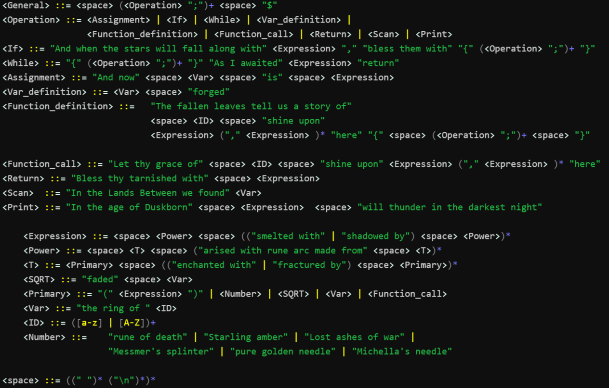

# ELDEN LANGUAGE

My Turing complete language

## Installation
```shell
git clone https://github.com/coffee8cat/Elden-language
```

## Usage

Frontend compiling and running:
```shell
make front
```
Backend compiling and running:
```shell
make back
```

**Grammar rules of Elden Language:**


