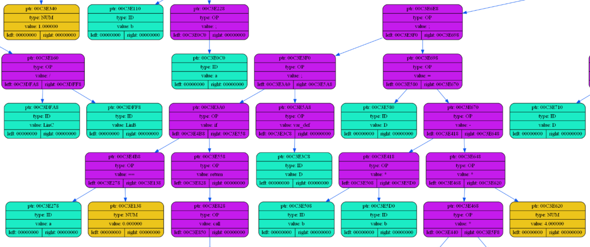

# ELDEN LANGUAGE

My Turing complete language. It consists of three modules: frontend, backend, SPU (view https://github.com/coffee8cat/SPU).
## Frontend
There are two stages of frontend processing:
 1. Lexical Tokenization - dividing programm code in tokens which correspond lexical rules of language for further handling, building ids table for all functions and variables.
 2. Recursive descent - building a syntax binary tree by processing nodes from array of tokens from the previous stage accoarding to grammar rules of my language and translating it to nodes of operations, arguments, functions specifications, etc.
 3. Saving tree of programm - saving binary tree with connected nodes of operations and arguments for opportunity of translating it to diverse assembly languages.

Syntax tree graphical dump example:


## Backend
 1. Reading tree of programm - loading binary tree.
 2. Translating to assembly - programm binary tree postfix traversal with translating to assembly operations.


## Grammar rules of Elden Language:

All grammar rules are described in picture below using ... :


## Installation
```shell
git clone https://github.com/coffee8cat/Elden-language
```

## Usage

Frontend compiling and running:
```shell
make front
```
Middleend + Backend compiling and running:
```shell
make back
```
